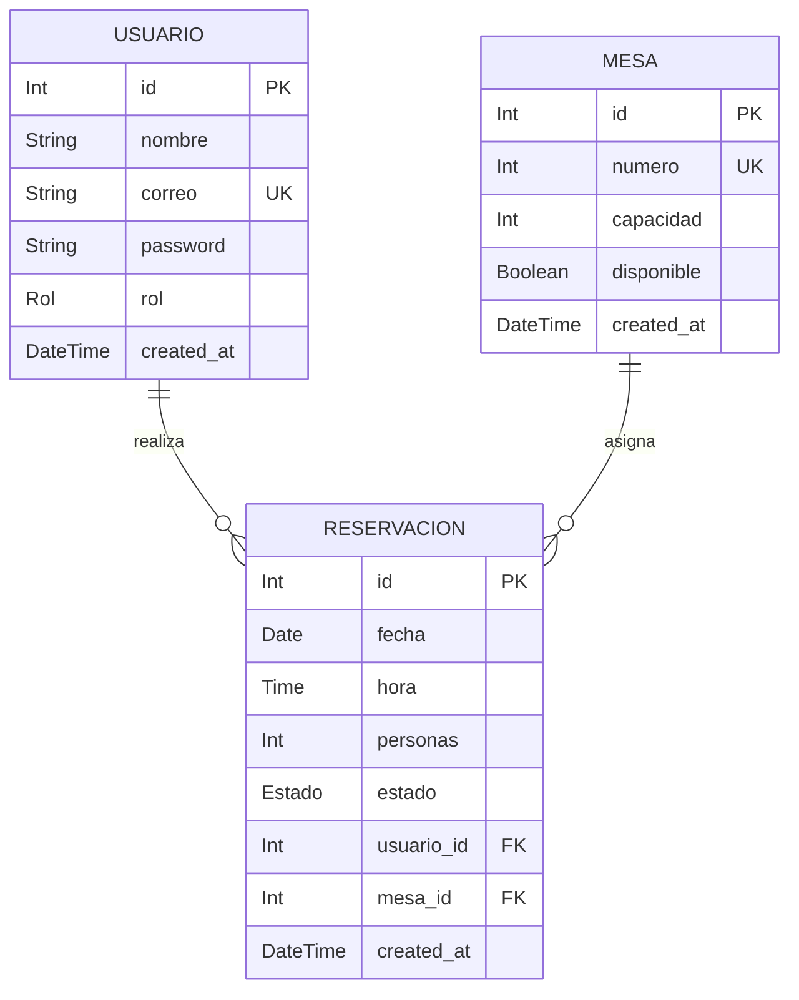

# 🏨 API REST —API_RESTAURANTE1
Tarea sobre conexión de API con una base de datos en PostgreSQL, con configuración de autentificación para acceder a diferentes tipos de usuarios de sistema,
através de contraseñas y correo electrónico. La API consiste en ingresar usuario y contraseña y que se pueda realizar reserva en el restaurante y se conozca la cantidad de mesas disponibles para la reserva. La API, puede identificar que mesas estan disponibles, permite además realizar actualizaciones y cancelaciones de reservas.

---

## 📋 Tabla de Contenidos
- [Descripción General](#-descripción-general)
- [Comandos de trabajo](#-comandos-trabajo)
- [Tecnologías](#-tecnologías)
- [Componentes del trabajo](#-componentes-trabajo)
- [Base de datos](#-base-datos)
  
---

## 📌 Descripción General

Construir una API que gestione una reserva en un restaurante, ingreseando y tomando información de una base de datos trabajada con tres tablas principales usuarios, mesas y reservaciones. En la API, se podrá ingresar usuarios y categorizarlos como administrador o cliente. Realizar reserva en el restaurante y verificar mesas disponibles. El servidor debe responder correctamente a peticiones GET, POST, PUT y DELETE.

---

## 🗂️ Comandos de trabajo 
Uso de comandos para manipulación de datos quemados de un arreglo:

| Comandos | Descripción |
|---|---|

|GET by id:| sirve para obtener un registro específico. Para lograrlo, se definen rutas con parámetros (req.params) y se captura el identificador dinámico de la URL. |

|POST:| Permite enviar datos desde el cliente (como formularios o JSON) al servidor para ser procesados o guardados. Para leer estos datos correctamente, debes utilizar el middleware.|

|PUT:| Su propósito principal es actualizar o reemplazar por completo un recurso existente en el servidor.|
 
|DELETE:| para eliminar recursos específicos del servidor. Por lo general, requiere un parámetro dentificador (como un :id) en la URL para saber exactamente qué elemento borrar.|

---

## 🛠️ Tecnologías

| Herramienta | Uso |
|---|---|
| Visual Studio Code | Codificación y pruebas |
| Express | Creación de servidor |
| Prisma | Sirve como un intermediario entre tu código fuente y la base de datos. |
| Github  | Para alojamiento de archivos |
| PostgreSQL | Gestor de bases de datos con el cual se comunicará la API |

---

## 🗂️ Componentes del trabajo

- **Entorno de Ejecución:** Node.js
- **Framework Web:** Express.js
- **ORM:** Prisma
- **Base de Datos:** PostgreSQL
- **Formato de Comunicación:** JSON

| Componentes | Descripción |
|---|---|
| Archivo index.js | Actúa como el punto de entrada principal para la API dentro de un proyecto|
| package.json | Funciona como un manual que contiene los metadatos de tu aplicación y una lista exacta de todas las librerías o herramientas de terceros que necesita para funcionar |
| Prima.config.ts| Especifica de forma programática dónde están tus archivos, cómo se manejan las migraciones, y qué scripts ejecutar para el seeding de datos|
| Archivo .gitignore | Archivo de texto plano donde se definen las reglas de qué archivos o carpetas debe ignorar Git. |
| Archivo Readme.md | Documento que describe el proyecto. |

---

## 🗄️ Base de Datos y Modelo (Prisma ORM)

El proyecto utiliza **PostgreSQL** administrado a través de **Prisma ORM**. A continuación se detalla la estructura del esquema y sus relaciones.

## 📊 Diagrama Entidad-Relación (ERD)


## 📝 Archivo schema.prisma

```generator client {
  provider = "prisma-client-js"
}

datasource db {
  provider = "postgresql"
  url      = env("DATABASE_URL")
}

model Usuario {
  id            Int           @id @default(autoincrement())
  nombre        String
  correo        String        @unique
  password      String
  rol           Rol           @default(cliente)
  createdAt     DateTime      @default(now()) @map("created_at")
  reservaciones Reservacion[]

  @@map("usuarios")
}

model Mesa {
  id            Int           @id @default(autoincrement())
  numero        Int           @unique
  capacidad     Int
  disponible    Boolean       @default(true)
  createdAt     DateTime      @default(now()) @map("created_at")
  reservaciones Reservacion[]

  @@map("mesas")
}

model Reservacion {
  id        Int      @id @default(autoincrement())
  fecha     DateTime @db.Date
  hora      DateTime @db.Time
  personas  Int
  estado    Estado   @default(pendiente)
  usuarioId Int      @map("usuario_id")
  mesaId    Int      @map("mesa_id")
  createdAt DateTime @default(now()) @map("created_at")

  usuario Usuario @relation(fields: [usuarioId], references: [id])
  mesa    Mesa    @relation(fields: [mesaId], references: [id])

  @@map("reservaciones")
}

enum Rol {
  cliente
  admin
}

enum Estado {
  pendiente
  confirmada
  cancelada
}
```


  

