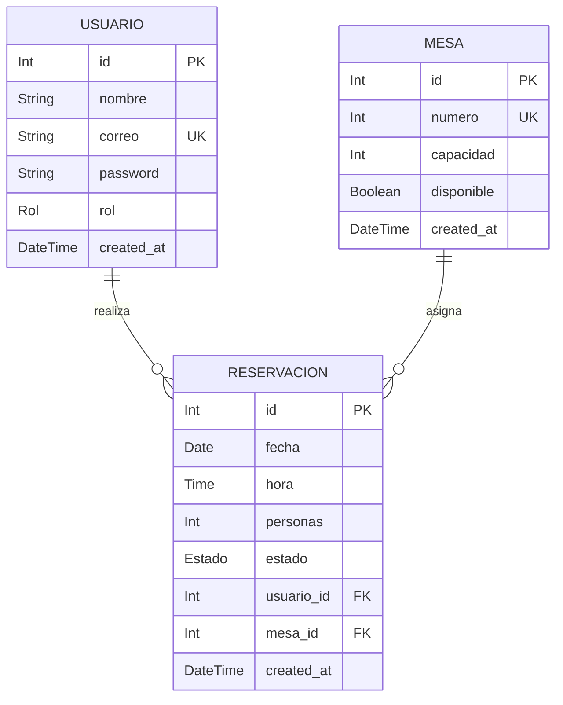

# 🏨 API REST —API_RESTAURANTE1
Tarea sobre conexión de API con una base de datos en PostgreSQL, con configuración de autentificación para acceder a diferentes tipos de usuarios de sistema,
através de contraseñas y correo electrónico. La API consiste en ingresar usuario y contraseña y que se pueda realizar reserva en el restaurante y se conozca la cantidad de mesas disponibles para la reserva. La API, puede identificar que mesas estan disponibles, permite además realizar actualizaciones y cancelaciones de reservas.

---

## 📋 Tabla de Contenidos
- [Descripción General](#-descripción-general)
- [Comandos de trabajo](#-comandos-trabajo)
- [Tecnologías](#-tecnologías)
- [Componentes del trabajo](#-componentes-trabajo)
- [Base de datos](#-base-datos)
  
---

## 📌 Descripción General

Construir una API que gestione una reserva en un restaurante, ingreseando y tomando información de una base de datos trabajada con tres tablas principales usuarios, mesas y reservaciones. En la API, se podrá ingresar usuarios y categorizarlos como administrador o cliente. Realizar reserva en el restaurante y verificar mesas disponibles. El servidor debe responder correctamente a peticiones GET, POST, PUT y DELETE.

---

## 🗂️ Comandos de trabajo 
Uso de comandos para manipulación de datos quemados de un arreglo:

| Comandos | Descripción |
|---|---|

|GET by id:| sirve para obtener un registro específico. Para lograrlo, se definen rutas con parámetros (req.params) y se captura el identificador dinámico de la URL. |

|POST:| Permite enviar datos desde el cliente (como formularios o JSON) al servidor para ser procesados o guardados. Para leer estos datos correctamente, debes utilizar el middleware.|

|PUT:| Su propósito principal es actualizar o reemplazar por completo un recurso existente en el servidor.|
 
|DELETE:| para eliminar recursos específicos del servidor. Por lo general, requiere un parámetro dentificador (como un :id) en la URL para saber exactamente qué elemento borrar.|

---

## 🛠️ Tecnologías

| Herramienta | Uso |
|---|---|
| Visual Studio Code | Codificación y pruebas |
| Express | Creación de servidor |
| Prisma | Sirve como un intermediario entre tu código fuente y la base de datos. |
| Github  | Para alojamiento de archivos |
| PostgreSQL | Gestor de bases de datos con el cual se comunicará la API |

---

## 🗂️ Componentes del trabajo

- **Entorno de Ejecución:** Node.js
- **Framework Web:** Express.js
- **ORM:** Prisma
- **Base de Datos:** PostgreSQL
- **Formato de Comunicación:** JSON

| Componentes | Descripción |
|---|---|
| Archivo index.js | Actúa como el punto de entrada principal para la API dentro de un proyecto|
| package.json | Funciona como un manual que contiene los metadatos de tu aplicación y una lista exacta de todas las librerías o herramientas de terceros que necesita para funcionar |
| Prima.config.ts| Especifica de forma programática dónde están tus archivos, cómo se manejan las migraciones, y qué scripts ejecutar para el seeding de datos|
| Archivo .gitignore | Archivo de texto plano donde se definen las reglas de qué archivos o carpetas debe ignorar Git. |
| Archivo Readme.md | Documento que describe el proyecto. |

---

## 🗄️ Base de Datos y Modelo (Prisma ORM)

El proyecto utiliza **PostgreSQL** administrado a través de **Prisma ORM**. A continuación se detalla la estructura del esquema y sus relaciones.

## 📊 Diagrama Entidad-Relación (ERD)


## 📝 Archivo schema.prisma

```generator client {
  provider = "prisma-client-js"
}

datasource db {
  provider = "postgresql"
  url      = env("DATABASE_URL")
}

model Usuario {
  id            Int           @id @default(autoincrement())
  nombre        String
  correo        String        @unique
  password      String
  rol           Rol           @default(cliente)
  createdAt     DateTime      @default(now()) @map("created_at")
  reservaciones Reservacion[]

  @@map("usuarios")
}

model Mesa {
  id            Int           @id @default(autoincrement())
  numero        Int           @unique
  capacidad     Int
  disponible    Boolean       @default(true)
  createdAt     DateTime      @default(now()) @map("created_at")
  reservaciones Reservacion[]

  @@map("mesas")
}

model Reservacion {
  id        Int      @id @default(autoincrement())
  fecha     DateTime @db.Date
  hora      DateTime @db.Time
  personas  Int
  estado    Estado   @default(pendiente)
  usuarioId Int      @map("usuario_id")
  mesaId    Int      @map("mesa_id")
  createdAt DateTime @default(now()) @map("created_at")

  usuario Usuario @relation(fields: [usuarioId], references: [id])
  mesa    Mesa    @relation(fields: [mesaId], references: [id])

  @@map("reservaciones")
}

enum Rol {
  cliente
  admin
}

enum Estado {
  pendiente
  confirmada
  cancelada
}
```
---
## 📝 Instalación, configuración y referecia práctica
**1. Introducción y Flujo de Trabajo Backend**
Esta guía resume las herramientas fundamentales para desarrollar una API REST moderna, escalable y segura con Node.js. El stack está compuesto por Express para la gestión de rutas HTTP, Prisma como ORM para la base de datos, JWT (JSON Web Token) para la autenticación de usuarios y Thunder Client para la realización de pruebas de endpoints.

Requisito previo: Inicializar el Proyecto
Antes de instalar cualquier librería, debes inicializar el archivo 'package.json' en la raíz de tu proyecto ejecutando:
npm init -y
Esto creará la estructura base para gestionar las dependencias de Node.js.

---
**2. Express.js (Framework Web)**
Express es el framework de desarrollo de aplicaciones web minimalista y flexible para Node.js. Proporciona un conjunto robusto de características para aplicaciones web y móviles.

Función Principal:

• Creación del Servidor: Levanta y gestiona el servicio HTTP en un puerto específico (ej. 3000 o 4000).

• Rutas (Endpoints): Organiza las peticiones (GET, POST, PUT, DELETE, etc.).

• Middlewares: Procesa y transforma las peticiones antes de llegar a la lógica principal (ej. parsear JSON con express.json() o validar tokens).


| Descripción  | Comando |
|---|---|
|Instalación de la librería principal| npm install express|
|Instalación de tipos de TypeScript (Opcional pero recomendado para autocompletado)  | npm install @types/express --save-dev  |

---
**3. Prisma (ORM - Object-Relational Mapping)**
Prisma es un ORM de última generación para Node.js y TypeScript. Facilita el modelado de datos, la gestión de migraciones de base de datos y proporciona un cliente fuertemente tipado para interactuar con la base de datos (PostgreSQL, MySQL, SQLite, etc.).
Función Principal:

• @prisma/client: Cliente generado automáticamente que utilizas en tu código para consultar y manipular la base de datos de manera segura y tipada.

• CLI de Prisma (prisma): Herramienta de desarrollo para crear migraciones, sincronizar esquemas y ejecutar Prisma Studio.

• Prisma Studio: Interfaz gráfica interactiva para explorar y editar tus datos directamente desde el navegador.


**Comandos de Instalación e Inicialización:**

| Descripción  | Comando |
|---|---|
| Instalar el cliente de Prisma (dependencia de producción)  | npm install @prisma/client |
| Instalar el CLI de Prisma (dependencia de desarrollo) | npm install prisma --save-dev |
| Inicializar Prisma en el proyecto (Crea la carpeta /prisma y el archivo .env) | npx prisma init |


**Comandos Clave de Trabajo con Prisma:**

| Descripción  | Comando |
|---|---|
| Ejecutar migraciones (aplica cambios al esquema en la Base de Datos)  | npx prisma migrate dev --name init |
| Generar/Actualizar el cliente tras modificar el esquema | npx prisma generate |
| Abrir la interfaz visual Prisma Studio | npx prisma studio |


---
**4. JWT (JSON Web Token)**
JWT es un estándar abierto (RFC 7519) para transmitir información de forma segura entre partes como un objeto JSON. Se utiliza principalmente para autenticación stateless (sin estado) en arquitecturas REST.

Función Principal:

• Generación del Token (jwt.sign): Al iniciar sesión correctamente, la API genera un token firmado con una clave secreta que contiene la información del usuario (ej. id, email).

• Verificación del Token (jwt.verify): En cada petición a una ruta protegida, el servidor valida la firma y vigencia del token enviado por el cliente.


**Comandos de Instalación:**

| Descripción  | Comando |
|---|---|
| Instalación de la librería de JWT | npm install jsonwebtoken |
| Instalación de definiciones de tipos (para TypeScript o autocompletado) | npm install @types/jsonwebtoken --save-dev |


---

**5. Thunder Client (Cliente HTTP en VS Code)**
Thunder Client es una extensión ligera y rápida para Visual Studio Code que permite probar endpoints de API REST sin necesidad de salir del entorno de desarrollo.

Función Principal:
• Pruebas de Endpoints: Realizar peticiones HTTP (GET, POST, PUT, DELETE, PATCH) enviando parámetros, query strings y cuerpo JSON.


• Gestión de Headers de Autenticación: Enviar de forma sencilla la cabecera 'Authorization: Bearer <TOKEN_JWT>' en las rutas protegidas.


• Colecciones y Entornos: Organizar endpoints en carpetas y guardar variables (como la URL base o tokens de pruebas).


**Pasos de Instalación:**
1. Opción Gráfica (VS Code): Abre la pestaña de Extensiones (Ctrl+Shift+X / Cmd+Shift+X), busca 'Thunder Client' y presiona 'Instalar'.
2. Opción desde Terminal: Puedes instalar la extensión ejecutando el siguiente comando en la consola:
code --install-extension rangav.vscode-thunder-client

---
**6. Ejemplo Integrado de Código (Express + Prisma + JWT)**

A continuación se presenta un código de demostración básico en Node.js que integra las tres tecnologías en una estructura simple:
const express = require('express');
const { PrismaClient } = require('@prisma/client');
const jwt = require('jsonwebtoken');

const app = express();
const prisma = new PrismaClient();
const JWT_SECRET = process.env.JWT_SECRET || 'clave_secreta_super_segura';

app.use(express.json());

// 1. Ruta de Login (Genera el Token JWT)
app.post('/api/login', async (req, res) => {
  const { email } = req.body;
  // Buscar usuario en BD mediante Prisma
  const user = await prisma.user.findUnique({ where: { email } });
  if (!user) return res.status(401).json({ error: 'Usuario no encontrado' });

  // Firmar token JWT
  const token = jwt.sign({ userId: user.id, email: user.email }, JWT_SECRET, { expiresIn: '2h' });
  return res.json({ message: 'Autenticado correctamente', token });
});

// 2. Middleware para verificar el JWT
function verifyToken(req, res, next) {
  const authHeader = req.headers['authorization'];
  const token = authHeader && authHeader.split(' ')[1]; // Formato 'Bearer TOKEN'
  if (!token) return res.status(401).json({ error: 'Acceso denegado, token requerido' });

  try {
    const decoded = jwt.verify(token, JWT_SECRET);
    req.user = decoded;
    next();
  } catch (error) {
    return res.status(403).json({ error: 'Token inválido o expirado' });
  }
}

// 3. Ruta Protegida
app.get('/api/perfil', verifyToken, async (req, res) => {
  const user = await prisma.user.findUnique({ where: { id: req.user.userId } });
  res.json({ message: 'Bienvenido al perfil protegido', user });
});

app.listen(3000, () => console.log('Servidor corriendo en http://localhost:3000'));

---
**7. Tabla Resumen de Comandos de Instalación**

| Herramienta  | Comando de instalación  | Tipo de dependencia |
|---|---|---|
| Express | npm install express | Producción |
| Prisma (Cliente) | npm install @prisma/client | Producción|
| Prisma (CLI) | npm install prisma --save-dev | Desarrollo|
| JWT| npm install jsonwebtoken| Producción |
		

---

## 📚Pasos para subir archivos a Github
**8. Inicialización y primer envío a GitHub**

**git init**

Inicializa un repositorio Git local dentro de la carpeta actual del proyecto. Crea la carpeta oculta .git para comenzar a rastrear cambios. 

**git add README.md**

Añade el archivo README.md al staging area (área de preparación), indicando a Git que este archivo específico se incluirá en el próximo commit.

**git commit -m "first commit"**

Guarda en el historial local una "foto" de los archivos preparados en el paso anterior, acompañándolo con el mensaje "first commit".

**git branch -M master**

Renombra la rama actual por defecto a master (asegurando el nombre principal de la rama de trabajo).

**git remote add origin [https://github.com/PatriciaMedinilla/API_RESTAURANTE1.git](https://github.com/PatriciaMedinilla/API_RESTAURANTE1.git)**

Vincula el repositorio local con un repositorio remoto en GitHub ubicado en esa dirección URL, asignándole el alias origin.

**git push -u origin master**

Sube los cambios locales guardados en la rama master al repositorio remoto (origin). El parámetro -u vincula ambas ramas para simplificar futuros comandos de subida.


---
**9. Flujo diario de trabajo (actualizaciones)**

**git status**

Muestra el estado actual del repositorio local: qué archivos han sido modificados, cuáles están en staging y cuáles aún no rastrea Git.

**git add .**

Prepara todos los archivos modificados, creados o eliminados en el directorio actual para ser guardados en el siguiente commit.

**git commit -m "Mensaje del commit"**

Crea un nuevo punto de guardado en el historial con todos los cambios preparados mediante git add ., usando la descripción indicada dentro de las comillas.

**git push origin master**

Envía los nuevos commits locales de la rama master al servidor en GitHub.


  

